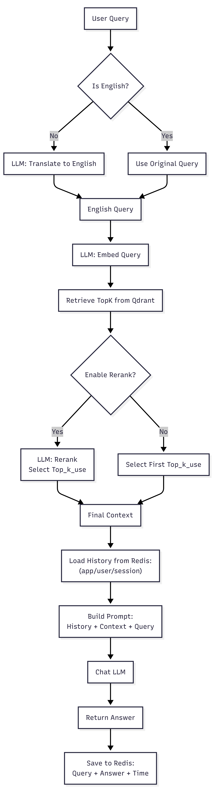
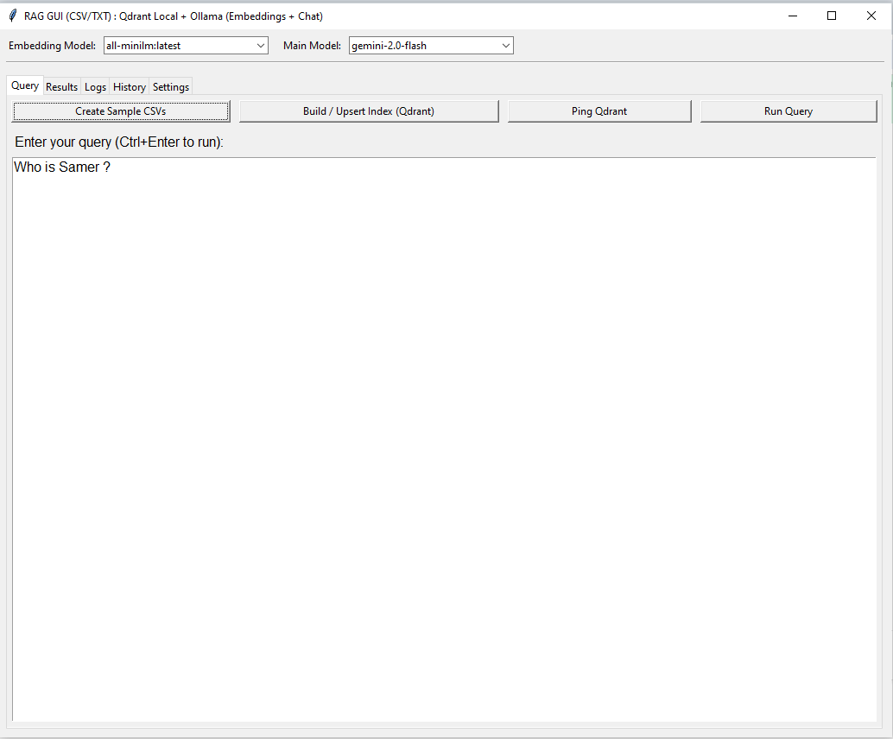
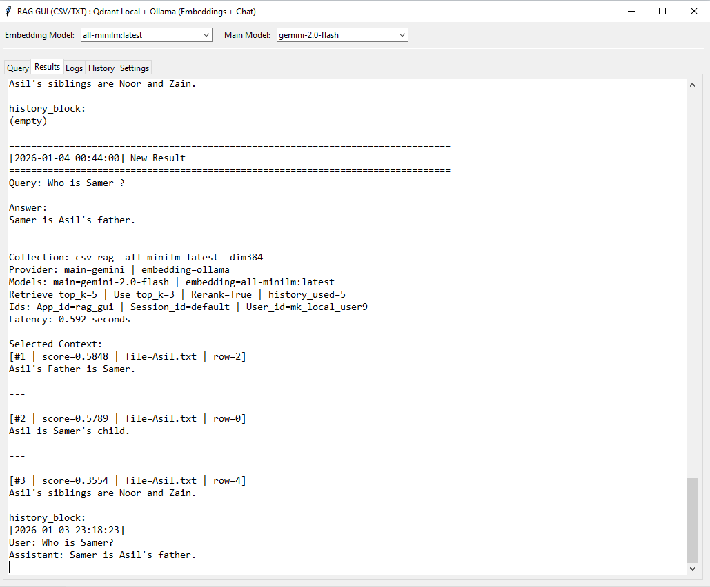
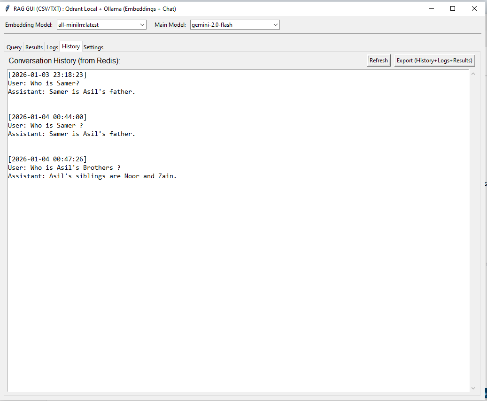
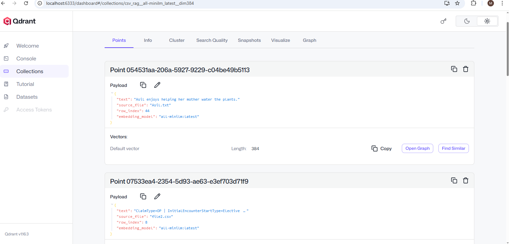
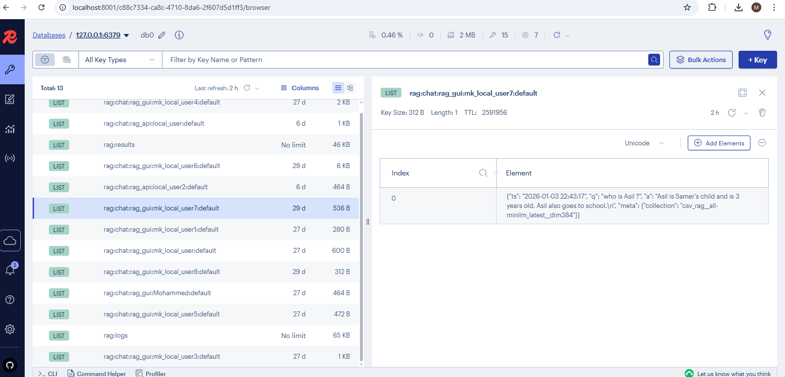
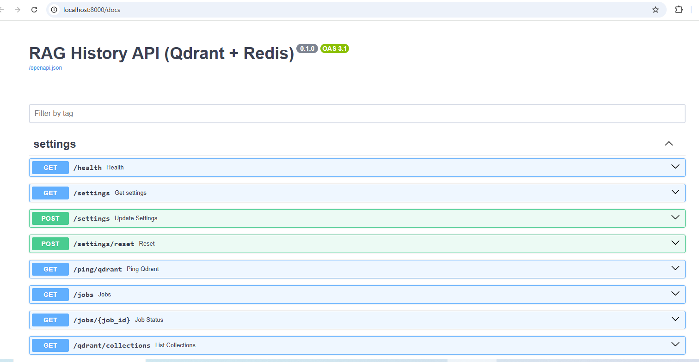

# LLMs_Tests

A collection of **clean, production-ready RAG (Retrieval-Augmented Generation) experiments** built with **Qdrant**, **Redis**, and multiple LLM providers (Ollama, Gemini, OpenAI).
This repository focuses on **RAG with history**, **clean architecture**, and **real-world usability** (API + GUI).

---

## 🔗 RAG History API — Qdrant + Redis
[👉 **RAG_API_Clean_Redis**](https://github.com/M-kadi/LLMs_Tests/tree/main/RAG/RAG_API_Clean_Redis)

A **FastAPI-based RAG API** that supports **conversation history**, **background jobs**, and **Redis-backed state**, designed for **production usage**.

### Key Features
- **RAG with History**
  - Prompt = **Context (Qdrant) + History (Redis) + Query**
- **Auto-Query Translation**
  - Non-English queries (Arabic, Turkish, Chinese, etc.) are automatically translated to English
  - Translation is performed before retrieval to match English-only Qdrant data
- **Redis Integration**
  - Conversation history (app_id / user_id / session_id)
  - Logs, results, background job state
  - Configurable TTL & max turns
- **Background Jobs**
  - Async index build & heavy operations
- **Multi-Provider Support**
  - Ollama (local)
  - Gemini (cloud)
  - OpenAI (cloud)
- **Flexible Ingestion**
  - CSV + TXT
  - Paragraph-based chunking
- **Config-Driven**
  - `rag_settings.json` (models, rerank, chunking, prompts)
- **Swagger API**
  - Fully documented `/docs`
  
### Main Endpoints
- `/health`
- `/settings`
- `/index/build`
- `/query`
- `/history`
- `/logs`
- `/results`
- `/jobs`

---

## 🖥️ RAG History GUI — Qdrant + Redis
[👉 **RAG_GUI_Clean_Redis**](https://github.com/M-kadi/LLMs_Tests/tree/main/RAG/RAG_GUI_Clean_Redis)

A **desktop GUI** for experimenting with **conversation-aware RAG**, built on top of the same clean architecture as the API.

### Key Features
- **Conversation History**
  - Redis-backed
  - Last N turns injected into prompt
- **Auto-Query Translation**
  - Non-English queries (Arabic, Turkish, Chinese, etc.) are automatically translated to English
  - Translation is performed before retrieval to match English-only Qdrant data
- **Rich GUI**
  - Query / Results / Logs / History / Settings tabs
- **History Management**
  - View & export History, Logs, Results
  - Auto-export on close (with confirmation)
- **Redis Controls**
  - Ping Redis
  - Enable/disable history
  - Control history turns
- **Safe Indexing**
  - Confirmation before rebuilding index
- **Multi-Provider Support**
  - Ollama (locally)
  - Gemini (cloud)
  - OpenAI (cloud)
- **Config-Driven**
  - `rag_settings.json` (models, rerank, chunking, prompts)
  
---

## ▶️ How to Run (Command Line)

### Start : Docker Desktop app and Ollama app
---
### Start Qdrant (Vector Database)

```bat
docker run -p 6333:6333 -p 6334:6334 ^
  -v %cd%\qdrant_data:/qdrant/storage ^
  qdrant/qdrant
```

- Qdrant Dashboard: http://localhost:6333/dashboard

---

### Start Redis

```bat
docker run -p 6379:6379 --name redis -d redis:7
```
---
### Start redisinsight

```bat
docker run -d ^
  --name redisinsight ^
  -p 8001:5540 ^
  redis/redisinsight
```
- redisinsight: http://localhost:5540/
- Add Redis Database: Host: `host.docker.internal` 

---
### Start Qdrant & Redis & redisinsight by docker `docker-compose.yml`

Start All
```bat
docker compose up -d
```

Stop All
```bat
docker compose down
```

---

### Run the RAG API (Development – Recommended)
##### From the Path: `RAG_API_Clean_Redis\app\main.py`

```bat
uvicorn main:app --host 0.0.0.0 --port 8000 --reload
```
##### Or by Click F5 in VS Code `RAG_API_Clean_Redis\.vscode\launch.json`
---

### Run the RAG API (Python)
##### From the Path: `RAG_API_Clean_Redis\main.py`

```bat
python main.py
```
- Swagger UI: http://localhost:8000/docs

---

## 🌐 URLs

- Swagger UI: http://localhost:8000/docs
- Qdrant Dashboard: http://localhost:6333/dashboard
- redisinsight: http://localhost:5540/

---
## FlowChart: RAG Qdrant History

---
## GUI Windows
#### Main Window



  ---
#### Results Window



---
#### Logs Window


---
#### History Window



---
#### Settings Window


---
#### Settings Window


---
#### Qdrant Collections



---
#### Redis Data


---
#### Swagger


---

## 🧠 Why This Repo?
- True **RAG with memory**
- Clean architecture (API / Core / Storage / GUI)
- Redis used correctly (history, jobs, logs, results)
- Production-minded design
- Easy to extend (multimodal RAG coming)
- Will use vLLM (coming)

---

## 📜 License
MIT License © 2026 Mohammed & Manaf
